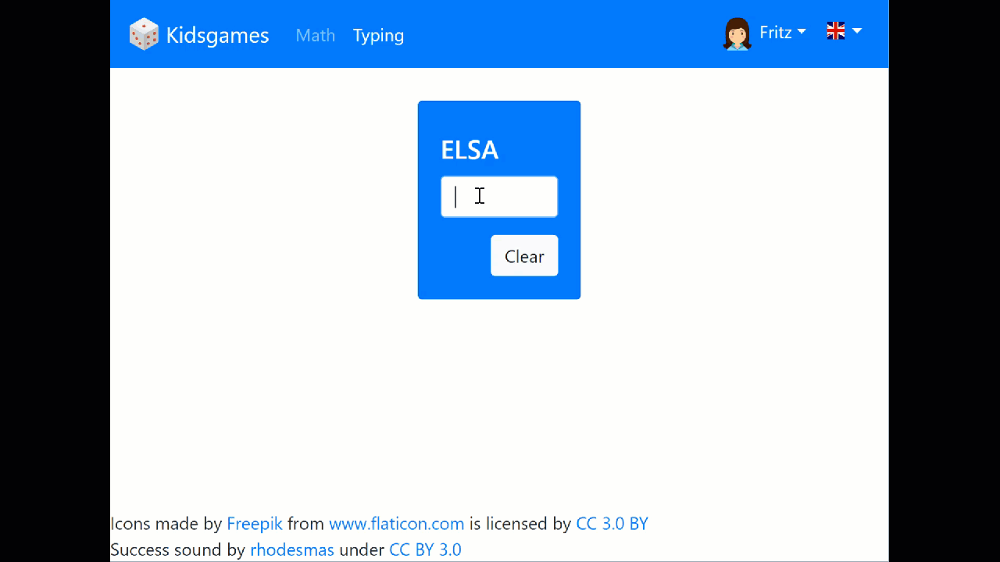
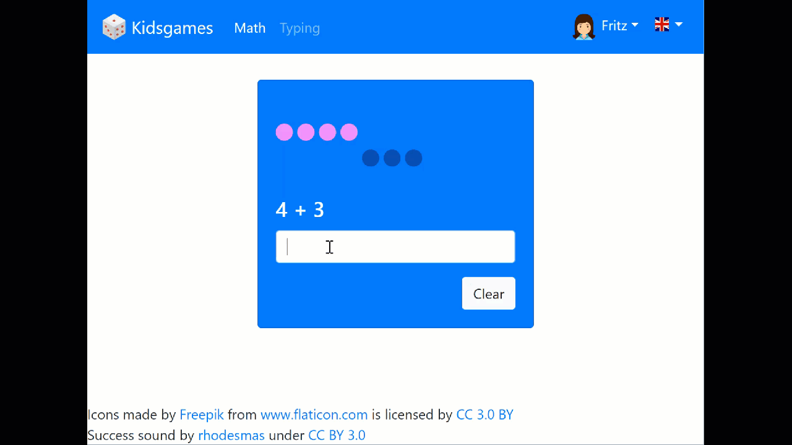

# kidsgames

This is a little side project for my 4 year old. Right now she enjoys writing names and add numbers. So I decided to create a little page to "gameify" the experience. 

You can check out a current demo [here](https://kidsgame.schwamster.xyz).

There is still a fair bit to do, but it is usable to a degree. Time will tell who looses interest first, me or my daughter :)

Typing Game: The game will show and read a word to you, that you have to type. If you typed the correct word the next word will appear.

Math Game: The game will show, read and visualize a simple math problem. If you type the correct answer the next problem will appear.

This is a very simple project that has dependencies to [Bootstrap 4 beta](https://getbootstrap.com/), [d3](https://github.com/d3/d3) and [React](https://facebook.github.io/react/).
[Webpack](https://webpack.github.io/) is used to bundle the sources.

## Getting started

If you want to get this to run locally, clone the project and run

    yarn 

in the root of the project to install all dependencies. 

After that you build locally

    yarn build-local

Then you can start the project by running

    yarn start
    
This will start the app under http://localhost:5000

During development I would recommend starting the app with the following command:

    yarn dev

This will start the app under http://localhost:8080 and the page will automatically refresh whenever you make changes to the javascript sources.

# Deploying

here are a couple of alternatives

 ## Deploying with Now

I recently started testing now from Zeit to deploy my pet projects and it works nicly. This project is ready to be deployed with now (Not that there is a lot to do for it).

Install now like this:

    npm install -g now
    
Then deploy your app by running this:

    now
    
That is it. All you have to do is create an account first time you run. You will be guided through the simple process when running now.

## Deploy to S3 with terraform and aws cli

setup the aws cli on your machine and setup your default profile. see https://aws.amazon.com/cli/

install terraform on your machine. see https://www.terraform.io/intro/getting-started/install.html

### prepare the infrastructure

the files already exit in this repo but here are detailed instructions if you want to follow along:

run:
    mkdir infrastructure
    cd infrastructure
    terraform init

create a new file e.g. kidsgame.tf with the following content (adjust the region to whatever fits you):

        provider "aws" {
            region     = "eu-west-1"
            profile    = "default"
        }

        resource "aws_s3_bucket" "somebucket" {
            bucket_prefix = "kidsgame-"
        
             website {
                index_document = "index.html"
            }
        }

        output "bucket-id" {
            value = "${aws_s3_bucket.somebucket.id}"
        }

        output "bucket-domain" {
            value = "${aws_s3_bucket.somebucket.bucket_domain_name}"
        }

        output "website-endpoint" {
            value = "${aws_s3_bucket.somebucket.website_endpoint}"
        }

Check out the following documentation if you want to know whats going on in that file: https://www.terraform.io/docs/providers/aws/r/s3_bucket.html

now run this:

    terraform apply

Take note of the of the Outputs. You will need the bucket-id and the website-endpoint later. Since terraform apply is idempotent you can however
call it again any time you want and it will return you the outputs again.

Head over to your aws console and check that the bucket has been created. Your "infrastructure" is now set up.

### build the application

run the following command in the root of the repo to build your application:

    yarn build-local

### deploy the application

in the root of the repo run the following command (the bucketname with the bucket-id you got earlier)
    
    aws s3 sync --delete --acl public-read .\dist\ s3://{bucketname}

You are done. Now open your browser and head over to the website-endpoint you got earlier.

### removing your bucket

If remove the infrastructure you can run

    terraform destroy

! This will fail as long as there are items in your bucket, so delete them first

    aws s3 rm --recursive s3://{bucketname}

alternativly you can add the following property to the bucket resource:

    force_destroy = "true"

### optional - add custom domain

If you already have a hosted zone in your aws account this is straight forward. Update your kidsgame.tf with the follwoing code:

        provider "aws" {
        region     = "eu-west-1"
        profile    = "default"
        }

        variable "domain" {
        }

        variable "subdomain" {
        }

        data "aws_route53_zone" "main" {
        name = "${var.domain}"
        private_zone = false
        }

        resource "aws_s3_bucket" "somebucket" {
        bucket = "${var.subdomain}.${substr(var.domain, 0, length(var.domain) -1)}"
        
        website {
            index_document = "index.html"
        }
        }

        resource "aws_route53_record" "kidsgame" {
        zone_id = "${data.aws_route53_zone.main.zone_id}"
        name    = "${var.subdomain}.${var.domain}"
        type    = "A"
        alias {
            name = "${aws_s3_bucket.somebucket.website_domain}"
            zone_id = "${aws_s3_bucket.somebucket.hosted_zone_id}"
            evaluate_target_health = false
        }
        }

        output "bucket-id" {
        value = "${aws_s3_bucket.somebucket.id}"
        }

        output "bucket-domain" {
        value = "${aws_s3_bucket.somebucket.bucket_domain_name}"
        }

        output "website-endpoint" {
        value = "${aws_s3_bucket.somebucket.website_endpoint}"
        }

now when you run "terraform apply" you will have to supply parameters (you can also set default values).
alternativly you can also specify them in the apply command. In my case that would maybe look like this:

        terraform apply -var 'domain=greenelephant.io.' -var 'subdomain=kidsgame'

Its important to note, that the bucket needs to have the same name as the url you want to create a record set for.

    